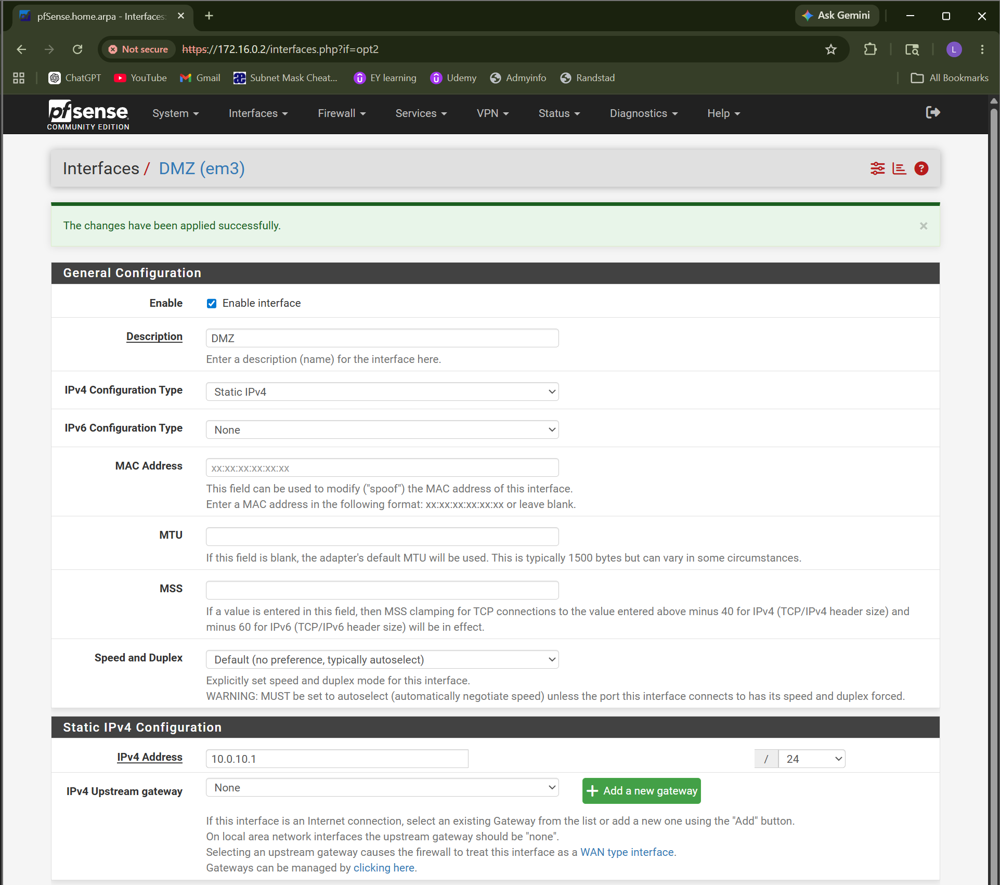
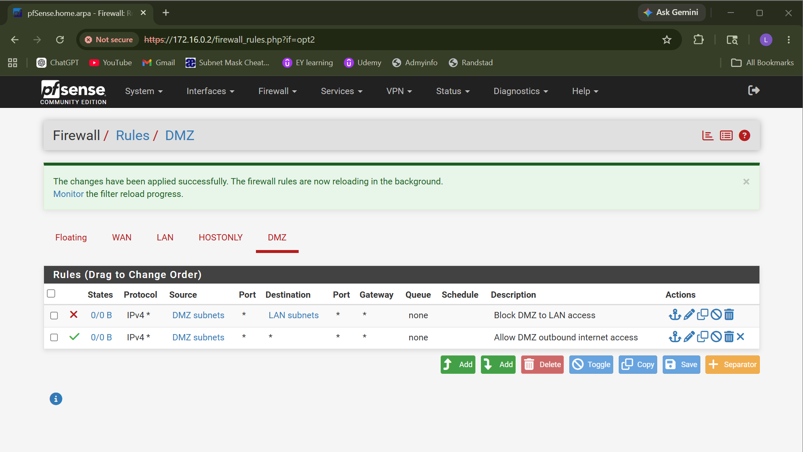
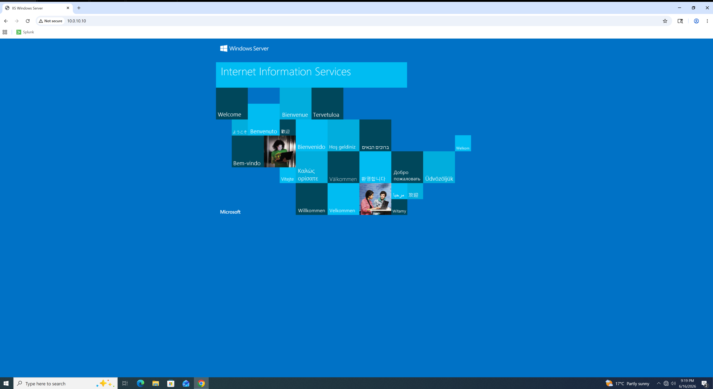
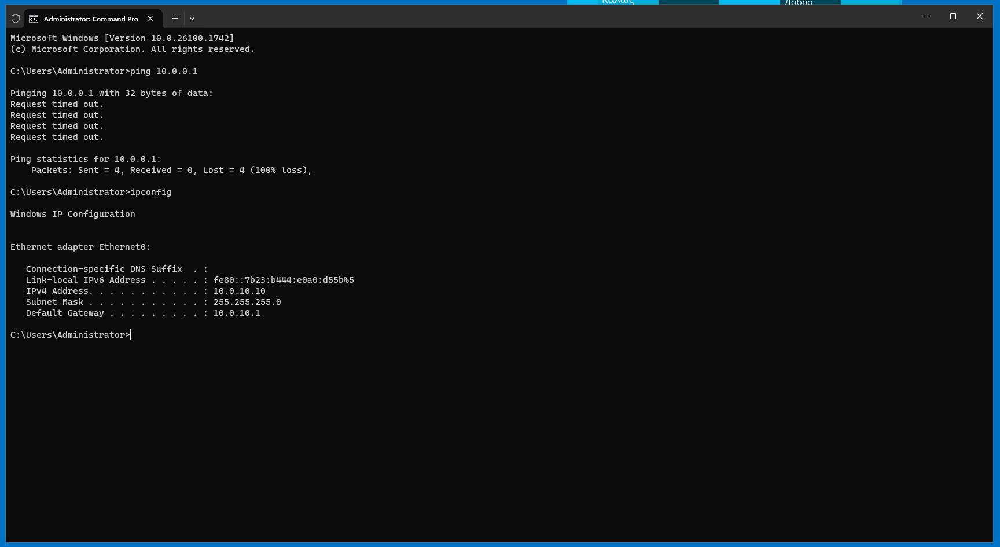

# DMZ Configuration

## Objective

The objective of this section is to configure a separate DMZ network in the pfSense firewall lab. The DMZ network hosts a Windows Server 2025 virtual machine that is separated from the internal LAN.

This setup demonstrates network segmentation by placing server resources in a separate network zone instead of keeping them directly inside the trusted LAN.

## DMZ Network Design

| Component                  | Configuration      |
| -------------------------- | ------------------ |
| DMZ Network Type           | VMware LAN Segment |
| DMZ Segment Name           | DMZ-Segment        |
| DMZ Subnet                 | 10.0.10.0/24       |
| pfSense DMZ Gateway        | 10.0.10.1          |
| Windows Server 2025 DMZ IP | 10.0.10.10         |
| Subnet Mask                | 255.255.255.0      |

## Planned DMZ Security Policy

| Traffic Flow    | Policy                                      |
| --------------- | ------------------------------------------- |
| LAN to DMZ      | Allow limited administrative access         |
| DMZ to LAN      | Block by default                            |
| DMZ to Internet | Allow required outbound access              |
| WAN to DMZ      | Allow only published services if configured |
| WAN to LAN      | Block                                       |

## Configuration Steps

### Step 1: Create DMZ LAN Segment in VMware

A separate VMware LAN Segment named `DMZ-Segment` was created for the DMZ network.

This LAN Segment was connected to:

* pfSense DMZ interface
* Windows Server 2025 DMZ server

### Step 2: Add DMZ Interface to pfSense

A new network adapter was added to the pfSense virtual machine and connected to the `DMZ-Segment`.

### Step 3: Add Windows Server 2025 to DMZ

The Windows Server 2025 virtual machine was connected to the same `DMZ-Segment`.

### Step 4: Configure pfSense DMZ Interface

The pfSense DMZ interface was configured with the following IP address:

```text
10.0.10.1/24
```

### Step 5: Configure Windows Server 2025 DMZ IP

The Windows Server 2025 VM was configured with a static IP address.

| Setting         | Value              |
| --------------- | ------------------ |
| IP Address      | 10.0.10.10         |
| Subnet Mask     | 255.255.255.0      |
| Default Gateway | 10.0.10.1          |
| DNS Server      | 10.0.10.1, 8.8.8.8 |

## Completed Configuration

### DMZ Interface Assignment

The DMZ interface was assigned in the pfSense console.

Final interface mapping:

| pfSense Interface | VMware Interface | IP Address                |
| ----------------- | ---------------- | ------------------------- |
| WAN               | em0              | DHCP - 192.168.126.133/24 |
| LAN               | em1              | 10.0.0.1/24               |
| HOSTONLY          | em2              | 172.16.0.2/24             |
| DMZ               | em3              | 10.0.10.1/24              |

### DMZ Interface Configuration

The DMZ interface was enabled and configured with a static IPv4 address.

| Setting                 | Value                   |
| ----------------------- | ----------------------- |
| Interface Name          | DMZ                     |
| IPv4 Configuration Type | Static IPv4             |
| IPv4 Address            | 10.0.10.1               |
| Subnet Mask             | /24                     |
| Purpose                 | Gateway for DMZ network |

### Windows Server 2025 DMZ Configuration

Windows Server 2025 was connected to the VMware `DMZ-Segment` LAN segment and configured with a static IP address.

| Setting         | Value              |
| --------------- | ------------------ |
| IP Address      | 10.0.10.10         |
| Subnet Mask     | 255.255.255.0      |
| Default Gateway | 10.0.10.1          |
| DNS Server      | 10.0.10.1, 8.8.8.8 |

### Temporary DMZ Connectivity Rule

A temporary firewall rule was created on the DMZ interface to allow initial connectivity testing.

| Setting        | Value                                                     |
| -------------- | --------------------------------------------------------- |
| Action         | Pass                                                      |
| Interface      | DMZ                                                       |
| Address Family | IPv4                                                      |
| Protocol       | Any                                                       |
| Source         | DMZ subnets                                               |
| Destination    | Any                                                       |
| Description    | TEMP - Allow DMZ traffic for initial connectivity testing |

This temporary rule allowed the DMZ server to reach the pfSense DMZ gateway and access the internet during initial testing.

After validation, this temporary rule was replaced with more restrictive production-style rules.

## Final DMZ Firewall Rules

The final DMZ firewall policy was configured to allow outbound internet access from the DMZ while blocking access from the DMZ into the trusted LAN.

| Rule Order | Action | Source      | Destination | Purpose                                             |
| ---------- | ------ | ----------- | ----------- | --------------------------------------------------- |
| 1          | Block  | DMZ subnets | LAN subnets | Prevent DMZ systems from accessing the internal LAN |
| 2          | Pass   | DMZ subnets | Any         | Allow outbound internet access from the DMZ         |

## LAN to DMZ Access Rule

A firewall rule was added on the LAN interface to allow the trusted LAN to access the DMZ server for administrative connectivity.

| Action | Interface | Source      | Destination | Purpose                                  |
| ------ | --------- | ----------- | ----------- | ---------------------------------------- |
| Pass   | LAN       | LAN subnets | 10.0.10.10  | Allow LAN admin access to the DMZ server |

## DMZ Web Server Configuration

### IIS Installation

Internet Information Services (IIS) was installed on the Windows Server 2025 DMZ server to simulate a public-facing web server hosted inside the DMZ.

The following PowerShell command was used on the DMZ server:

```powershell
Install-WindowsFeature -Name Web-Server -IncludeManagementTools
```

After installation, IIS was tested locally from the DMZ server using:

```text
http://localhost
```

The default IIS welcome page loaded successfully, confirming that the web service was running on the DMZ server.

### LAN Access to DMZ Web Server

The Windows 10 LAN client was used to test access to the DMZ web server.

Test URL:

```text
http://10.0.10.10
```

Result:

```text
Successful - The default IIS welcome page loaded from the Windows 10 LAN client.
```

This confirms that the trusted LAN can access the web service hosted on the DMZ server.

### WAN Port Forwarding to DMZ Web Server

A NAT port forwarding rule was configured on pfSense to allow WAN-side access to the DMZ web server.

Instead of exposing the web server directly on external port 80, a custom external port was used.

| Setting              | Value                          |
| -------------------- | ------------------------------ |
| Interface            | WAN                            |
| Protocol             | TCP                            |
| External/WAN Port    | 8085                           |
| Destination          | WAN address                    |
| Redirect Target IP   | 10.0.10.10                     |
| Redirect Target Port | 80                             |
| Description          | WAN TCP 8085 to DMZ Web Server |

Traffic flow:

```text
WAN Client -> pfSense WAN IP:8085 -> DMZ Web Server 10.0.10.10:80
```

### WAN Access Test

The DMZ web server was tested from the WAN side using the pfSense WAN IP address and external port `8085`.

Test URL:

```text
http://192.168.126.133:8085
```

Result:

```text
Successful - The default IIS welcome page loaded through the pfSense WAN port forward.
```

This confirms that WAN-side traffic to pfSense on TCP port `8085` was successfully forwarded to the IIS web server running on the DMZ server.

### WAN Private Network Note

Because this lab uses VMware NAT networking, the pfSense WAN interface received a private IP address:

```text
192.168.126.133
```

To allow WAN-side testing from the VMware private network, the following WAN setting was disabled in pfSense:

```text
Block private networks and loopback addresses
```

This setting was disabled only because the lab WAN network uses private RFC1918 addressing. In a real public-facing firewall deployment, this setting is normally kept enabled unless there is a specific design requirement to allow private upstream traffic.

## Validation Tests

### Test 1: DMZ Server Internet Access

The Windows Server 2025 DMZ server was tested for outbound internet connectivity.

Command used:

```cmd
ping 8.8.8.8
```

Result:

```text
Successful - 4 packets sent, 4 packets received, 0% packet loss
```

This confirms that the DMZ server can reach the internet through pfSense.

### Test 2: DMZ DNS Resolution

DNS resolution was tested from the Windows Server 2025 DMZ server.

Command used:

```cmd
nslookup google.com
```

Result:

```text
Successful - google.com resolved to public IPv4 and IPv6 addresses
```

This confirms that DNS resolution is working from the DMZ network.

### Test 3: DMZ to LAN Block Test

The Windows Server 2025 DMZ server was tested against the internal LAN gateway.

Command used:

```cmd
ping 10.0.0.1
```

Result:

```text
Blocked - 4 packets sent, 0 packets received, 100% packet loss
```

This confirms that the firewall rule blocking DMZ-to-LAN traffic is working as expected.

### Test 4: LAN to DMZ Admin Access

The Windows 10 LAN client was tested for connectivity to the Windows Server 2025 DMZ server.

Command used:

```cmd
ping 10.0.10.10
```

Result:

```text
Successful - 4 packets sent, 4 packets received, 0% packet loss
```

This confirms that the internal LAN can reach the DMZ server through the firewall rule allowing LAN-to-DMZ administrative access.

### Test 5: IIS Web Server Local Test

IIS was tested locally from the Windows Server 2025 DMZ server.

Test URL:

```text
http://localhost
```

Result:

```text
Successful - The default IIS welcome page loaded locally on the DMZ server.
```

This confirms that IIS was installed and running correctly on the DMZ server.

### Test 6: LAN to DMZ Web Server Access

The Windows 10 LAN client was tested for web access to the IIS server hosted in the DMZ.

Test URL:

```text
http://10.0.10.10
```

Result:

```text
Successful - The default IIS welcome page loaded from the LAN client.
```

This confirms that LAN-to-DMZ web access is working.

### Test 7: WAN to DMZ Web Server Access

WAN-side access to the DMZ web server was tested using pfSense NAT port forwarding.

Test URL:

```text
http://192.168.126.133:8085
```

Result:

```text
Successful - The default IIS welcome page loaded through the pfSense WAN port forward.
```

This confirms that external/WAN-side traffic to pfSense TCP port `8085` is forwarded to the DMZ web server on TCP port `80`.

### Test 8: Final DMZ to LAN Block Validation

The Windows Server 2025 DMZ server was tested again to confirm it could not initiate access into the trusted LAN.

Command used:

```cmd
ping 10.0.0.1
```

Result:

```text
Blocked - 4 packets sent, 0 packets received, 100% packet loss
```

This confirms that the DMZ server remains isolated from the trusted LAN even after IIS and WAN port forwarding were configured.


## Validation Summary

| Test                        | Source                | Destination         | Expected Result | Actual Result |
| --------------------------- | --------------------- | ------------------- | --------------- | ------------- |
| Internet connectivity       | DMZ Server            | 8.8.8.8             | Allowed         | Successful    |
| DNS resolution              | DMZ Server            | google.com          | Allowed         | Successful    |
| DMZ to LAN access           | DMZ Server            | 10.0.0.1            | Blocked         | Blocked       |
| LAN to DMZ admin access     | Windows 10 LAN Client | 10.0.10.10          | Allowed         | Successful    |
| IIS local test              | DMZ Server            | localhost           | Allowed         | Successful    |
| LAN to DMZ web access       | Windows 10 LAN Client | 10.0.10.10:80       | Allowed         | Successful    |
| WAN to DMZ web access       | WAN-side client       | pfSense WAN IP:8085 | Allowed         | Successful    |
| Final DMZ to LAN validation | DMZ Server            | 10.0.0.1            | Blocked         | Blocked       |

The validation confirms that the DMZ server can access the internet and resolve DNS, the trusted LAN can access the DMZ web server, WAN-side access works through pfSense NAT port forwarding, and the DMZ server cannot initiate access back into the trusted LAN.


## Screenshots Collected

### 1. pfSense DMZ Interface Configuration

This screenshot shows the DMZ interface enabled in pfSense with the static IPv4 address `10.0.10.1/24`.



### 2. Final DMZ Firewall Rules

This screenshot shows the final DMZ firewall rules. The first rule blocks DMZ-to-LAN traffic, and the second rule allows DMZ outbound internet access.



### 3. LAN Access to DMZ Web Server

This screenshot shows the Windows 10 LAN client successfully accessing the IIS web server hosted on the Windows Server 2025 DMZ server.



### 4. WAN to DMZ NAT Port Forward Rule

This screenshot shows the pfSense NAT port forwarding rule that forwards WAN TCP port `8085` to the DMZ web server on `10.0.10.10:80`.


### 5. WAN Access to DMZ Web Server

This screenshot shows successful WAN-side access to the DMZ IIS web server through the pfSense WAN IP using TCP port `8085`.


### 6. WAN Firewall Rule for DMZ Web Server

This screenshot shows the WAN firewall rule associated with the NAT port forward for allowing TCP `8085` traffic to the DMZ web server.


### 7. DMZ to LAN Block Validation

This screenshot shows the Windows Server 2025 DMZ server failing to ping the internal LAN gateway `10.0.0.1`, confirming that DMZ-to-LAN traffic is blocked.


