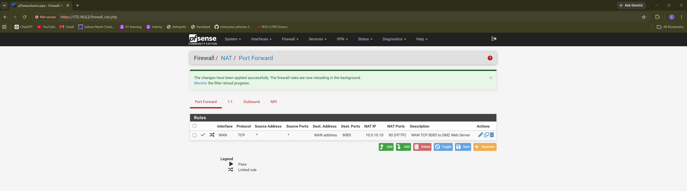
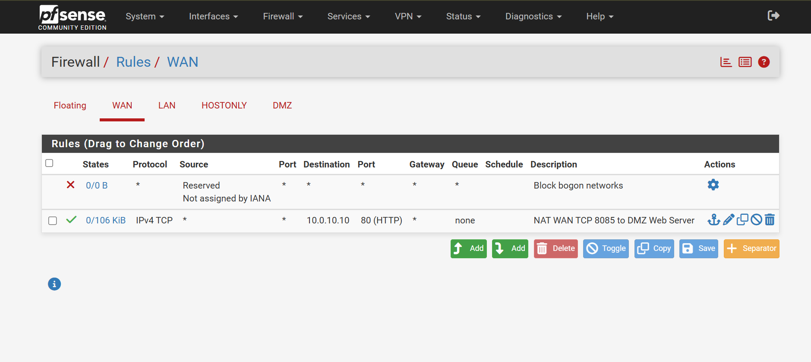
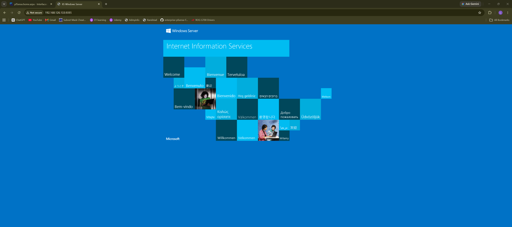

# NAT Port Forwarding

## Objective

This section documents the NAT port forwarding configuration used to publish the DMZ web server through pfSense.

The goal is to allow controlled WAN-side access to a web service hosted in the DMZ without allowing direct access to the internal LAN.

## NAT Scenario

A Windows Server 2025 virtual machine is hosted in the DMZ network and running IIS.

Instead of exposing the web server on standard external port `80`, pfSense forwards a custom WAN port to the internal DMZ web server.

## NAT Traffic Flow

WAN-side Client
↓
HTTP request to pfSense WAN IP on TCP `8085`
↓
pfSense WAN Interface
↓
NAT Port Forward
↓
DMZ Web Server `10.0.10.10:80`

## NAT Rule Details

| Setting              | Value                          |
| -------------------- | ------------------------------ |
| Interface            | WAN                            |
| Address Family       | IPv4                           |
| Protocol             | TCP                            |
| Source               | Any                            |
| Destination          | WAN address                    |
| External Port        | 8085                           |
| Redirect Target IP   | 10.0.10.10                     |
| Redirect Target Port | 80                             |
| Description          | WAN TCP 8085 to DMZ Web Server |

## Port Mapping

| External Access     | Internal Destination |
| ------------------- | -------------------- |
| pfSense WAN IP:8085 | 10.0.10.10:80        |

## Why Use External Port 8085?

A custom external port was used instead of exposing the web service directly on port `80`.

This demonstrates how pfSense can publish an internal service using a different external port while still forwarding traffic to the correct internal service port.

## Associated WAN Firewall Rule

pfSense created an associated WAN firewall rule for the NAT port forward.

| Action | Interface | Protocol | Source | Destination | Port |
| ------ | --------- | -------- | ------ | ----------- | ---- |
| Pass   | WAN       | TCP      | Any    | WAN address | 8085 |

This rule allows WAN-side clients to reach pfSense on TCP port `8085`.

## WAN Private Network Lab Note

In this lab, the pfSense WAN interface received a private VMware NAT IP address:

`192.168.126.133`

Because the WAN interface is using private RFC1918 addressing in VMware, the following setting was disabled on the pfSense WAN interface:

`Block private networks and loopback addresses`

This was required only for lab testing. In a real public internet-facing firewall deployment, this option is normally kept enabled unless private WAN addressing is intentionally used.

## Validation Test

WAN-side access was tested using the pfSense WAN IP and external TCP port `8085`.

Test URL:

`http://192.168.126.133:8085`

Expected result:

The default IIS welcome page should load.

Actual result:

Successful - The default IIS welcome page loaded through the pfSense WAN port forward.

## Security Outcome

The NAT configuration successfully demonstrates controlled exposure of a DMZ service.

* WAN-side clients can access only the published web service.
* The web server remains inside the DMZ network.
* The trusted LAN is not exposed to WAN-side clients.
* External TCP port `8085` is forwarded to internal TCP port `80`.
* Access is controlled through pfSense NAT and WAN firewall rules.

## Screenshots

### NAT Port Forward Rule

This screenshot shows the pfSense NAT port forward from WAN TCP port `8085` to the DMZ web server on TCP port `80`.

### WAN Firewall Rule

This screenshot shows the associated WAN firewall rule allowing TCP port `8085`.

### WAN Access Test

This screenshot shows successful WAN-side access to the DMZ IIS web server through pfSense WAN TCP port `8085`.

